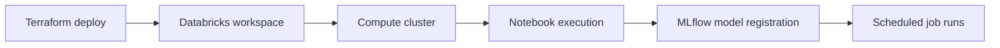
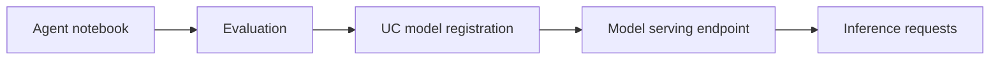
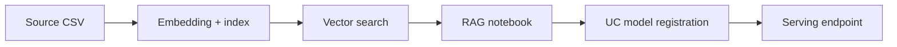
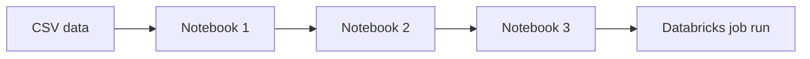

# **`Ch3rry Pi3 | Azure`**

Terraform-first Microsoft Azure projects demonstrating **standalone platform capabilities**, **machine learning & AI workflows**, and **practical Databricks-based architectures**.

This organisation focuses on **isolated, skill-driven Azure use cases** rather than full end-to-end data platforms. Repositories are designed to showcase how individual Azure services and patterns work in practice, with a strong emphasis on **Databricks**, **machine learning**, and **modern AI workloads**.

Core themes include:

* **Azure Databricks as a compute and ML platform**
* **Infrastructure as Code** (Terraform-first provisioning)
* **Unity Catalog–aware ML workflows**
* **Model training, registration, and serving**
* **GenAI, RAG, and agent-style architectures**
* **Repeatable, script-driven deployments**

## **`What you’ll find in this organisation`**

### **Core capabilities demonstrated**

* **Databricks platform fundamentals**

  * Workspace provisioning
  * Compute configuration
  * Notebook and job orchestration
* **Machine learning & AI**

  * MLflow model training and registration
  * Unity Catalog–backed model governance
  * Databricks model serving endpoints
* **Generative AI patterns**

  * Agent-style notebook workflows
  * Retrieval-Augmented Generation (RAG)
  * Vector search + embedding pipelines
* **Security and access**

  * Managed identity and service principal patterns
  * Key Vault–backed secret management
  * Unity Catalog permissions and grants
* **Operational realism**

  * Scripted deploy/destroy flows
  * Separation between infra, compute, and workloads
  * Manual steps called out where platform constraints apply

## **`Repositories (selected highlights)`**

The repositories below represent **key capability areas** within this organisation. Others follow similar patterns and build on the same foundations.

### 1) **Databricks Machine Learning (Azure)**

**Standalone ML workflows on Azure Databricks**

Terraform-driven setup demonstrating how to provision a Databricks workspace, compute, notebooks, and jobs for **classical machine learning workflows**.

**Highlights**

* Databricks workspace + compute provisioned via Terraform
* Notebooks uploaded and executed via Databricks Jobs
* Unity Catalog–aware notebooks using widgets for catalog/schema/volume
* MLflow model registration with UC-compatible signatures
* Clear separation between infra, notebooks, and execution

**Typical workflow**

**Patterns to look for**

* Job-driven ML execution (not ad hoc notebooks)
* UC-compatible model registration
* Scripted deployment for repeatability

### 2) **Databricks GenAI Agents**

**Agent-style GenAI workflows on Azure Databricks**

Terraform-driven Databricks setup focused on **agent-style notebooks**, Unity Catalog integration, and model serving.

**Highlights**

* Unity Catalog metastore assignment automated via Terraform
* Compute with preinstalled GenAI / ML libraries
* Notebook-driven agent evaluation and registration
* Model serving endpoint provisioned via Terraform
* Scale-to-zero and workload sizing exposed as IaC

**Agent lifecycle**

**Patterns to look for**

* Clear separation between experimentation and serving
* UC-first model governance
* Terraform-managed serving infrastructure

### 3) **Azure Databricks RAG (Azure OpenAI + Vector Search)**

**End-to-end RAG infrastructure as composable Azure services**

A more advanced standalone project demonstrating how to compose **Azure OpenAI**, **Databricks**, **Unity Catalog**, **Vector Search**, and **Key Vault** into a working RAG system.

**Highlights**

* Azure OpenAI account + deployment via Terraform
* Databricks Vector Search permissions automated
* Unity Catalog external locations for RAG data
* Secure secret flow via Key Vault
* Model serving endpoint deployed only after model registration

**RAG workflow**

**Patterns to look for**

* Explicit ordering constraints (model must exist before serving)
* SP-based auth for UC and Vector Search
* Separation between infra deploy and notebook execution

### 4) **Databricks Data Analytics (Azure)**

**Notebook-driven analytics pipelines on Databricks**

A lighter-weight analytics-focused project demonstrating Databricks jobs, notebook uploads, and structured execution without a full data engineering stack.

**Highlights**

* Databricks workspace and compute provisioned via Terraform
* Notebooks uploaded to a shared workspace path
* Job pipeline executes notebooks in order
* Unity Catalog–aware storage access via volumes

**Analytics execution flow**

**Patterns to look for**

* Job-based orchestration over manual execution
* Clear separation between data, notebooks, and infra
* UC-compatible storage access

## **`Common engineering themes across repos`**

### **Terraform-first Azure provisioning**

* One module per concern (RG, Databricks, compute, notebooks, jobs, serving)
* Helper scripts orchestrate multi-module deployments
* Sensitive values written to gitignored tfvars or `.env`

### **Databricks as a unified ML & AI platform**

* Notebooks for experimentation
* Jobs for repeatability
* MLflow + Unity Catalog for governance
* Model Serving for production-style inference

### **Pragmatic automation**

* Terraform where supported
* Manual steps documented where APIs do not exist
* Clear sequencing between infra, data, and models

## **`Scope note (current)`**

Repositories in this organisation focus exclusively on **Microsoft Azure**, with a strong emphasis on **Azure Databricks–centric ML and AI workloads**. Over time, this organisation may expand to include additional Azure services and non-ML standalone patterns.

